<div align="center">

# 🚀 ITJob — Recruitment & Job Matching Ecosystem

**A full-stack, production-grade recruitment platform connecting Candidates, Employers, and Administrators**

[](https://openjdk.org/)
[](https://spring.io/projects/spring-boot)
[](https://www.postgresql.org/)
[](https://www.rabbitmq.com/)
[](https://react.dev/)
[](https://nextjs.org/)
[](https://vitejs.dev/)
[](https://ant.design/)
[](https://mui.com/)
[](https://docs.docker.com/compose/)
[](LICENSE)

[Getting Started](#-getting-started) · [Architecture](#-system-architecture) · [Tech Stack](#-technology-stack) · [Features](#-key-features--business-flows) · [Roadmap](#-roadmap)

</div>

---

## ⚡ Highlights

> Dành cho người đọc nhanh — những điểm nổi bật cốt lõi của dự án.

| # | Highlight | Mô tả |
|---|-----------|-------|
| 🏗️ | **Kiến trúc Monorepo 3-tier** | Backend REST API + Admin Dashboard + Client Web App, tổ chức theo domain modules |
| 📨 | **Async Job Recommendation Engine** | RabbitMQ message queue + DLQ + exponential back-off + rate-limited SMTP (≤1000 emails/phút) |
| 🔐 | **AOP-Driven Dynamic RBAC** | Custom `@RequirePermission` annotation + `PermissionAspect` lookup từ DB, không hardcode role |
| 📊 | **Email Analytics Dashboard** | KPI summary cards, trend charts (Chart.js), filterable email history, CSV export |
| 🔑 | **JWT Authentication + Google OAuth2** | Stateless JWT authentication, Google OAuth2 login, refresh token support |
| ☁️ | **Cloudinary File Storage** | Upload CV/Resume + Avatar qua Cloudinary CDN, không lưu file trên server |
| 🐳 | **Docker-ready** | Multi-stage Dockerfile + Docker Compose (Backend + PostgreSQL + RabbitMQ) |
| 🔄 | **GitHub Actions CI/CD** | Auto build & push Docker image cho cả 3 module khi push `master` |
| 📱 | **Responsive UI** | Material UI (Client) + Ant Design (Admin)
| 🧪 | **Enterprise Development Patterns** | MapStruct DTO mapping, Spring Filter dynamic queries, Thymeleaf email templates, scheduled cleanup jobs |

---

## 📸 Screenshots


### Admin Dashboard
<!--  -->


### Email Analytics
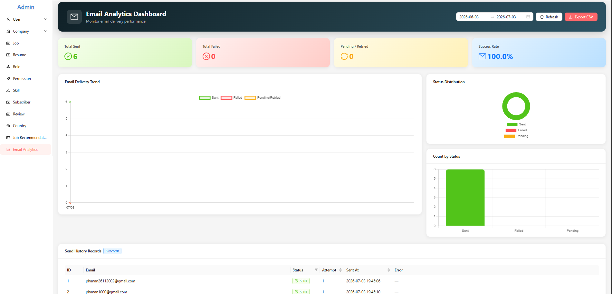


### Job Recommendation Management
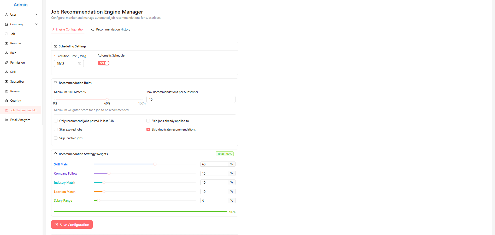
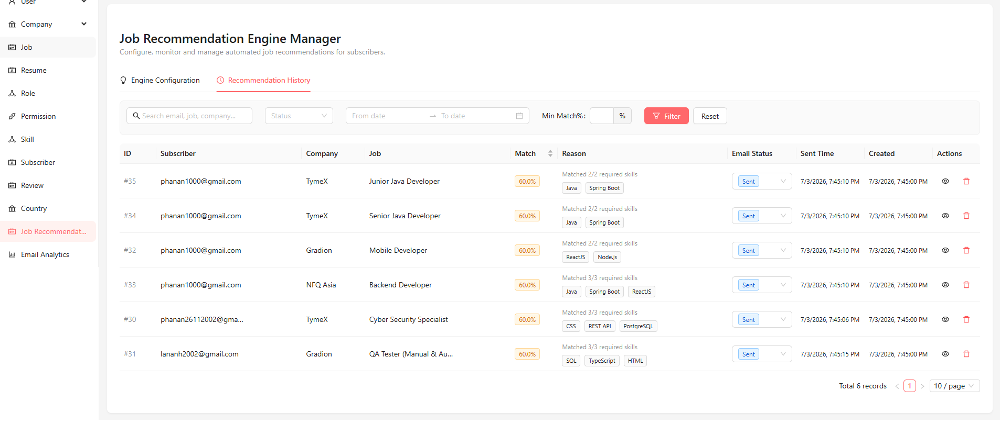

### Client — Homepage
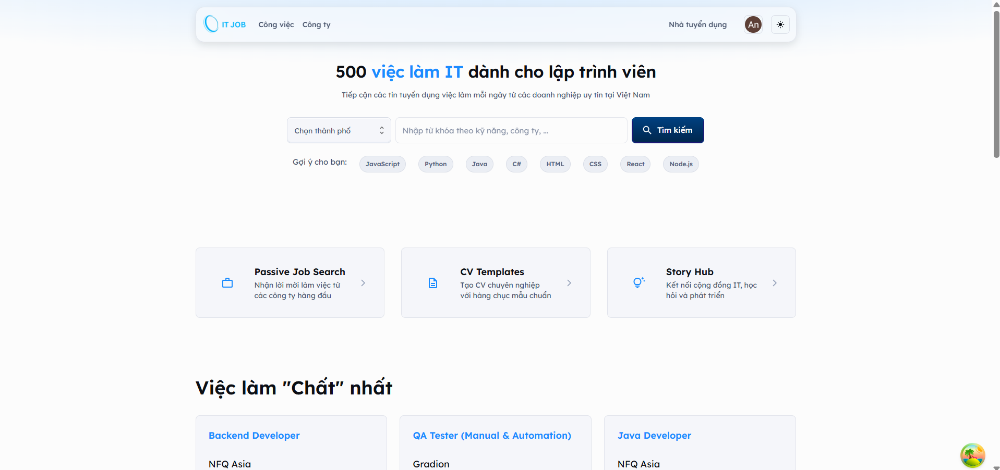


### Client — Job Search & Detail
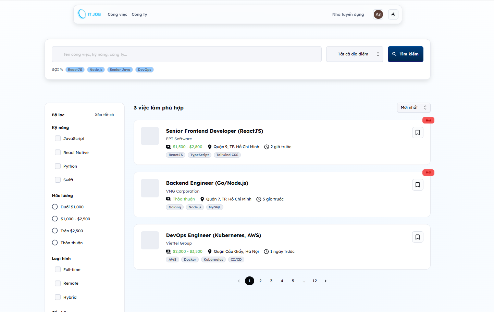
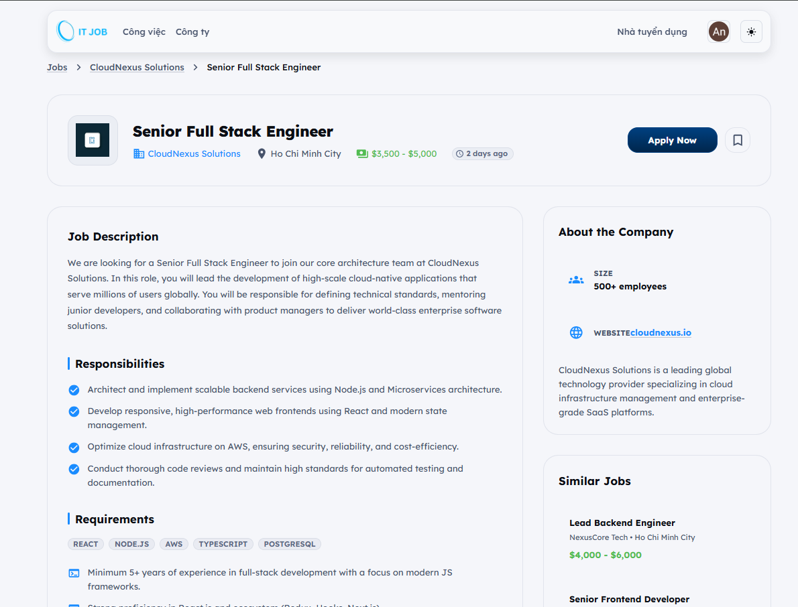

### Client — Company Search & Profile
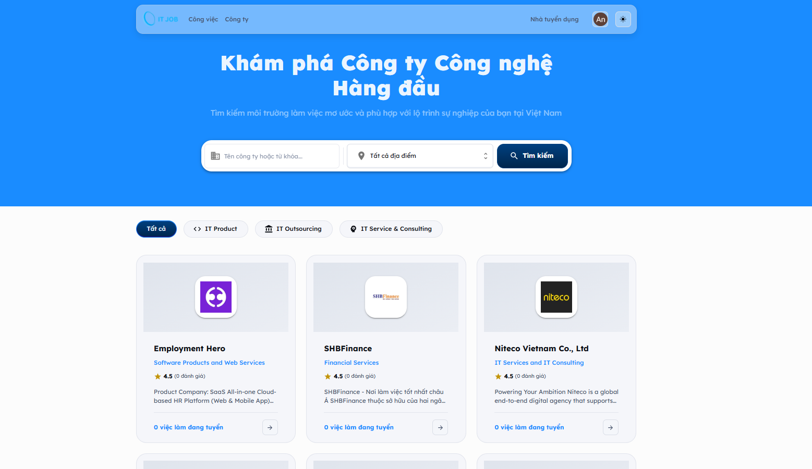
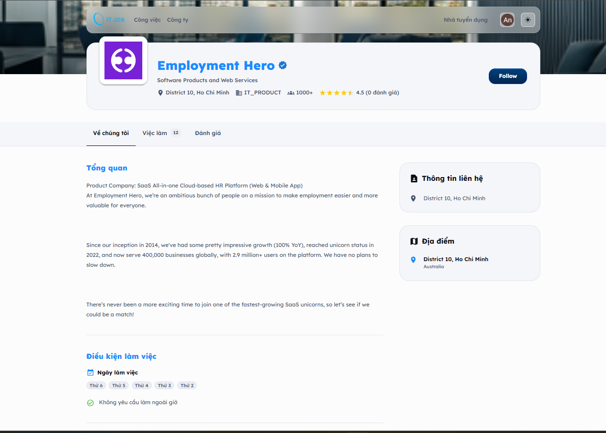
---

## 🏗️ System Architecture

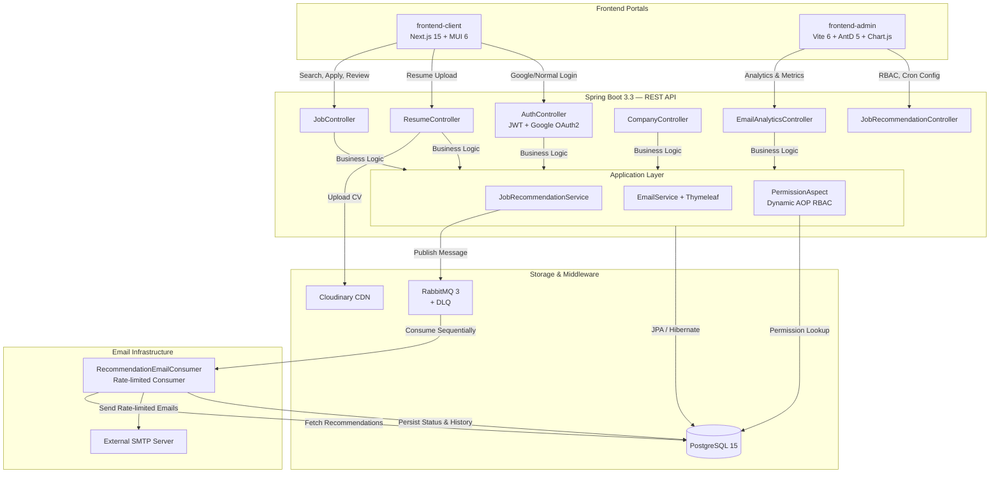

---

## 🛠️ Technology Stack

### Backend — Spring Boot REST API

| Category | Technologies |
|----------|-------------|
| **Language & Runtime** | Java 20, Gradle 8.4 (Kotlin DSL) |
| **Core Framework** | Spring Boot 3.3.2, Spring Web, Spring Security |
| **Authentication** | OAuth2 Resource Server (JWT/JWS), Google OAuth2 Client |
| **Data Access** | Spring Data JPA, Hibernate, PostgreSQL 15 |
| **Messaging** | Spring AMQP, RabbitMQ 3 (Exchange + Queue + DLQ) |
| **API Docs** | SpringDoc OpenAPI 2.5 (Swagger UI) |
| **DTO Mapping** | MapStruct 1.5.5, Lombok |
| **File Storage** | Cloudinary HTTP 1.39 |
| **Email** | Spring Mail, Thymeleaf Templates |
| **Monitoring** | Spring Boot Actuator |
| **Query DSL** | Spring Filter JPA 3.1.7 (TurkRaft) |
| **Validation** | Spring Boot Starter Validation (Jakarta Bean Validation) |
| **Testing** | JUnit 5, Spring Security Test |

### Frontend Admin — Vite Dashboard

| Category | Technologies |
|----------|-------------|
| **Core** | React 18, TypeScript 5.6, Vite 6 |
| **UI Library** | Ant Design (AntD) 5.23 |
| **State Management** | Redux Toolkit 2.6, React Redux 9 |
| **Data Fetching** | TanStack React Query 5 |
| **Charts** | Chart.js 4.5, React-Chartjs-2 5.3 |
| **Routing** | React Router DOM 7 |
| **Forms** | React Hook Form 7 |
| **Animations** | Framer Motion 12, Lottie React |
| **Rich Text** | Quill 2, MDEditor 4 |
| **Utilities** | Axios 1.7, Day.js, Lodash, jwt-decode, async-mutex |

### Frontend Client — Next.js Web App

| Category | Technologies |
|----------|-------------|
| **Core** | React 18, Next.js 15 (App Router, Turbopack) |
| **UI Library** | Material UI (MUI) 6, Emotion |
| **State Management** | Redux Toolkit 2.5, React Redux 9 |
| **Data Fetching** | TanStack React Query 5 |
| **Authentication** | Next-Auth 5 (Beta) + Custom Middleware |
| **Styling** | TailwindCSS 3.4 |
| **HTTP Client** | Axios 1.7, async-mutex (token refresh) |

### DevOps & Infrastructure

| Category | Technologies |
|----------|-------------|
| **Containerization** | Docker (Multi-stage build), Docker Compose |
| **CI/CD** | GitHub Actions (3 workflows: backend, admin, client) |
| **Database** | PostgreSQL 15 (Docker) |
| **Message Broker** | RabbitMQ 3 Management (Docker) |
| **File CDN** | Cloudinary |

---

## 📂 Project Structure

```text
ITJob/
├── .github/
│   └── workflows/
│       ├── backend-dev-ci.yml          # Backend Docker build & push
│       ├── frontend-admin-dev.ci.yml   # Admin Docker build & push
│       └── frondend-client-dev.ci.yml  # Client Docker build & push
│
├── backend/                            # Spring Boot REST API
│   ├── Dockerfile                      # Multi-stage: gradle:8.4-jdk20 → temurin:20-jre
│   ├── build.gradle.kts                # Kotlin DSL build config
│   └── src/main/java/vn/phantruongan/backend/
│       ├── authentication/             # JWT login, Google Sign-in, email verification
│       ├── authorization/              # Roles, Permissions, dynamic RBAC mapping
│       ├── bookmark/                   # Candidate saved jobs/companies
│       ├── company/                    # Employer profiles, countries data
│       ├── config/
│       │   ├── auth/                   # SecurityConfiguration, JwtAuthenticationConverter
│       │   ├── cache/                  # Caching configuration
│       │   ├── cloudinary/             # Cloudinary upload config
│       │   ├── cors/                   # CORS policy
│       │   ├── jwt/                    # JwtService, JwtConfiguration
│       │   ├── scheduler/             # Async/Scheduling config
│       │   ├── swagger/               # OpenAPI/Swagger config
│       │   └── web/                    # WebMvc configuration
│       ├── cronjob/                    # JobRecommendationScheduler
│       ├── extenals/                   # External service integrations
│       ├── file/                       # File upload services (Cloudinary)
│       ├── follow/                     # Candidate following companies
│       ├── job/                        # Job postings, applications, specifications
│       ├── log/                        # Audit logging
│       ├── notification/               # System notification entities & enums
│       ├── profile/                    # User profile updates
│       ├── publics/                    # Public (unauthenticated) endpoints
│       ├── recommendation/
│       │   ├── controllers/            # JobRecommendationController, EmailAnalyticsController
│       │   ├── services/               # RecommendationEmailConsumer, CleanupTask
│       │   ├── entities/               # JobRecommendation, EmailSendHistory
│       │   └── repositories/           # JPA repositories
│       ├── report/                     # Reporting module
│       ├── resume/                     # CV/Resume submissions
│       ├── review/                     # Employer ratings & reviews
│       ├── subscriber/                 # Job alert subscribers
│       └── util/
│           └── aspects/                # PermissionAspect (AOP security)
│
├── frontend-admin/                     # Vite + React Admin Dashboard
│   └── src/
│       ├── apis/                       # API modules (axios instances)
│       │   ├── constants/apiPath.ts    # Centralized API path definitions
│       │   ├── emailAnalyticsModule.ts # Email analytics API calls
│       │   └── recommendationModule.tsx
│       ├── components/                 # Reusable: Breadcrumb, Loading, Table, Modal
│       ├── config/                     # Axios interceptor config
│       ├── guards/                     # Auth guard (route protection)
│       ├── layouts/                    # Admin layout, Dashboard sidebar/navbar
│       ├── page/
│       │   ├── dashboard/              # Overview dashboard
│       │   ├── user/                   # User management CRUD
│       │   ├── company/                # Company management
│       │   ├── job/                    # Job postings management
│       │   ├── resume/                 # Resume review
│       │   ├── role/                   # Role configuration
│       │   ├── permission/             # Permission configuration
│       │   ├── skill/                  # Skills management
│       │   ├── subscriber/             # Subscriber management
│       │   ├── country/                # Country data management
│       │   ├── review/                 # Reviews moderation
│       │   ├── recommendation/         # Job recommendation config
│       │   └── email-analytics/        # Email analytics dashboard
│       ├── redux/                      # Redux store & slices
│       ├── routes/                     # React Router config & paths
│       └── styles/                     # Global styles
│
├── frontend-client/                    # Next.js Candidate/Employer App
│   └── src/
│       ├── app/
│       │   ├── (auth)/                 # Sign-in & Sign-up pages
│       │   ├── jobs/                   # Job search, [id] detail page
│       │   ├── companies/              # Company listing, [id] profile
│       │   ├── candidate/
│       │   │   ├── dashboard/          # Candidate overview
│       │   │   ├── my-jobs/            # Applied jobs tracking
│       │   │   ├── cv-attachment/      # CV/Resume management
│       │   │   ├── job-invitations/    # Employer invitations
│       │   │   ├── notifications/      # System notifications
│       │   │   └── profile/            # Profile settings
│       │   └── verify-email/           # Email verification landing
│       ├── apis/                       # API service layer
│       ├── auth/                       # Next-Auth configuration
│       ├── components/                 # Hero, HotJobs, TopEmployers, FAQ, etc.
│       ├── configs/                    # App configuration
│       ├── layouts/                    # Page layouts
│       ├── redux/                      # Redux store
│       ├── shared-theme/              # MUI theme customization
│       └── ui/                         # Shared UI primitives
│
├── production/
│   ├── docker-compose.yaml             # Full-stack: Backend + PostgreSQL + RabbitMQ
│   └── .env.example                    # Environment variables template
│
└── README.md
```

---

## 🌟 Key Features & Business Flows

### 1. Asynchronous Job Recommendation Engine

Hệ thống recommendation tự động match job seekers với việc làm phù hợp dựa trên skills:

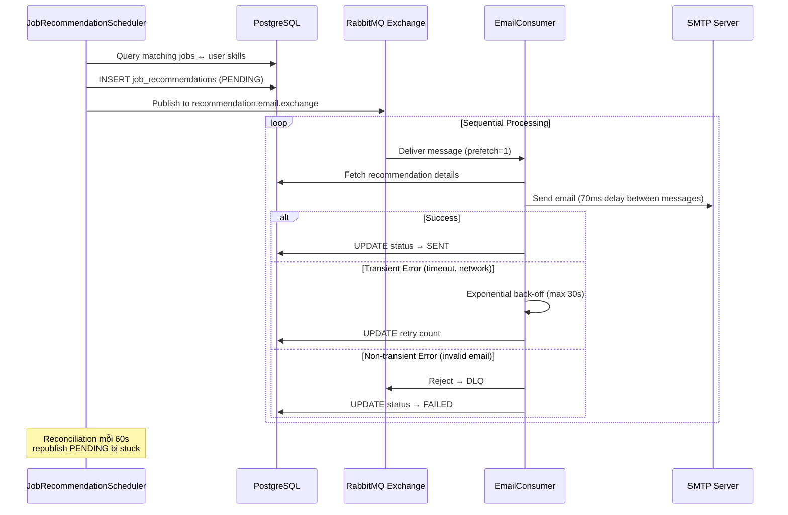

**Chi tiết kỹ thuật:**
- **Rate limiting**: Delay 70ms giữa các email → tối đa ~857 emails/phút (dưới ngưỡng 1,000/phút)
- **Exponential back-off**: `Math.min(1000 × 2^(retryCount-1), 30000)ms`
- **DLQ routing**: Non-transient errors chuyển vào `recommendation.email.queue.dlq`
- **Reconciliation**: Scheduler 60s republish các item PENDING bị stuck do broker crash
- **Auto cleanup**: `EmailSendHistoryCleanupTask` chạy daily lúc 02:00 AM, xóa logs > 180 ngày

### 2. AOP-Driven Dynamic RBAC (Role-Based Access Control)

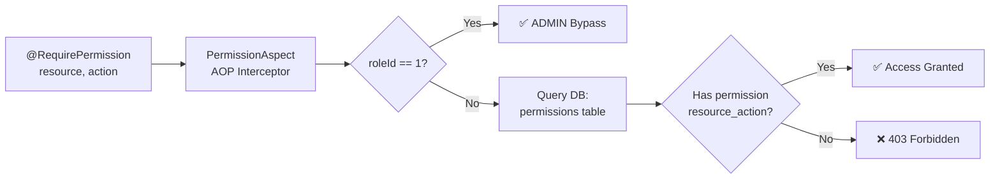

- Controller endpoints dùng `@RequirePermission(resource = ResourceEnum.xxx, action = ActionEnum.xxx)`
- `PermissionAspect` extract `roleId` từ JWT, query database để validate
- Admin (`roleId = 1L`) bypass toàn bộ permission checks
- Roles khác (EMPLOYER, CANDIDATE, MANAGER) được validate dynamic từ DB

### 3. Email Analytics & Monitoring

- **Real-time tracking**: Mỗi SMTP transaction ghi lại attempts, status (`SENT`/`FAILED`/`PENDING`), error messages
- **Dashboard**: KPI cards, Line/Donut/Bar charts (Chart.js), filterable records table
- **CSV Export**: Download toàn bộ records dưới dạng CSV
- **Date range filter**: Lọc analytics theo khoảng thời gian tùy chọn
- **Auto cleanup**: Tự động xóa history logs quá 180 ngày

### 4. Client-Side Features

| Feature | Mô tả |
|---------|-------|
| **Job Search & Filter** | Tìm kiếm việc làm theo keyword, location, category với Spring Filter DSL |
| **Job Application** | Ứng tuyển trực tiếp, upload CV qua Cloudinary |
| **Company Profiles** | Xem thông tin công ty, đánh giá, reviews từ ứng viên |
| **Bookmarks** | Lưu việc làm/công ty yêu thích |
| **Follow Companies** | Theo dõi công ty để nhận thông báo việc làm mới |
| **Job Alerts** | Đăng ký subscriber nhận email thông báo việc phù hợp |
| **Email Verification** | Xác thực email qua Thymeleaf template |
| **Candidate Dashboard** | Theo dõi đơn ứng tuyển, quản lý CV, job invitations |
| **Google Sign-in** | Đăng nhập nhanh qua Google OAuth2 |

### 5. Admin Management Features

| Feature | Mô tả |
|---------|-------|
| **User Management** | CRUD users, assign roles, view activity |
| **Company Management** | Verify, create, edit employer profiles |
| **Job Moderation** | Review, approve/reject job postings |
| **Resume Review** | Xem và tải xuống CV ứng viên |
| **Role & Permission Config** | Dynamic RBAC configuration UI |
| **Skill Management** | Quản lý danh sách skills cho matching |
| **Subscriber Management** | Quản lý email subscribers |
| **Country & Location Data** | Quản lý dữ liệu địa lý |
| **Review Moderation** | Kiểm duyệt reviews/ratings |

---

## ⚡ Getting Started

### Prerequisites

- **Java 20+** (hoặc JDK tương thích)
- **Node.js 18+** & npm
- **Docker** (cho PostgreSQL & RabbitMQ)
- **PostgreSQL 15** (hoặc dùng Docker)

### 1. Clone Repository

```bash
git clone https://github.com/PhanTruongAn/ITJob.git
cd ITJob
```

### 2. Start Infrastructure (Docker)

```bash
# Chạy PostgreSQL + RabbitMQ
cd production
docker-compose up -d job-db rabbitmq

# Hoặc chạy RabbitMQ standalone
docker run -d --name rabbitmq -p 5672:5672 -p 15672:15672 rabbitmq:3-management
```

> **Nếu container đã tồn tại:** `docker start rabbitmq` hoặc `docker start job-db`

### 3. Configure Environment

**Backend** — Copy và chỉnh sửa config:
```bash
cd backend/src/main/resources
cp application-example.properties application.properties
```

Cập nhật các giá trị trong `application.properties`:
```properties
# Database
spring.datasource.url=jdbc:postgresql://localhost:5432/itjob
spring.datasource.username=your_username
spring.datasource.password=your_password

# JWT
jwt.base64-secret=your_base64_secret_key
jwt.access-token-validity-in-seconds=10
#expiration: 7 day
jwt.refresh-token-validity-in-seconds=604800

# Cloudinary
cloudinary.cloud-name=your_cloud_name
cloudinary.api-key=your_api_key
cloudinary.api-secret=your_api_secret

# SMTP Email
spring.mail.host=smtp.gmail.com
spring.mail.port=587
spring.mail.username=your_email
spring.mail.password=your_app_password

# Google OAuth2
app.google-client-id=your_google_client_id

# Email retry & analytics configuration
email.max-retries=3
email.backoff-base-ms=1000
email.backoff-max-ms=30000
email.history.retention-days=180

# Cron for cleanup (daily 02:00 AM): second minute hour day month weekday
email.history.cleanup-cron=0 0 2 * * *
```

**Frontend Admin** — Tạo `.env`:
```bash
# frontend-admin/.env
VITE_BACKEND_URL=http://localhost:8080/
```

**Frontend Client** — Tạo `.env`:
```bash
# frontend-client/.env
NEXT_PUBLIC_API_URL=http://localhost:8080/api/v1
```

### 4. Run Backend API

```bash
cd backend
./gradlew bootRun
# API available at http://localhost:8080
# Swagger UI at http://localhost:8080/swagger-ui/index.html
```

### 5. Run Frontend Admin

```bash
cd frontend-admin
npm install
npm run dev
# Dashboard at http://localhost:3100
```

### 6. Run Frontend Client

```bash
cd frontend-client
npm install
npm run dev
# Client app at http://localhost:3000
```

### Full Docker Deployment

```bash
cd production
cp .env.example .env
# Edit .env with your credentials
docker-compose up -d
```

---

## 🔄 CI/CD Pipeline

Mỗi module có GitHub Actions workflow riêng, trigger khi push `master`:

| Workflow | Trigger Path | Action |
|----------|-------------|--------|
| `backend-dev-ci.yml` | `backend/**` | Build Docker → Push `phantruongan2611/itjob-backend:latest` |
| `frontend-admin-dev.ci.yml` | `frontend-admin/**` | Build Docker → Push to Docker Hub |
| `frondend-client-dev.ci.yml` | `frontend-client/**` | Build Docker → Push to Docker Hub |

---

## 📝 Roadmap

> Dự án vẫn đang được phát triển. Các tính năng dưới đây nằm trong lộ trình triển khai và sẽ được bổ sung trong các phiên bản tiếp theo.

- [ ] **Interactive Resume Builder** — Trình tạo CV.
- [ ] **Resume Parsing AI** — OCR/Parsing tự động extract skills từ PDF resume uploads
- [ ] **Multi-language Support** — i18n cho cả Admin và Client
- [ ] **Transactional Outbox Pattern** — Ngăn dual-write inconsistency giữa SQL inserts và RabbitMQ enqueue
- [ ] **Notification System** — Real-time push notifications (WebSocket/SSE)
- [ ] **Advanced Search** — Elasticsearch integration cho full-text search
- [ ] **API Rate Limiting** — Implement rate limiting cho public endpoints
- [ ] **Caching Layer** — Redis caching cho frequently accessed data

---

## 📄 License

This project is licensed under the MIT License — see the [LICENSE](LICENSE) file for details.

---

<div align="center">

**Built by [Phan Trường An](https://github.com/PhanTruongAn)**

</div>
]]>
